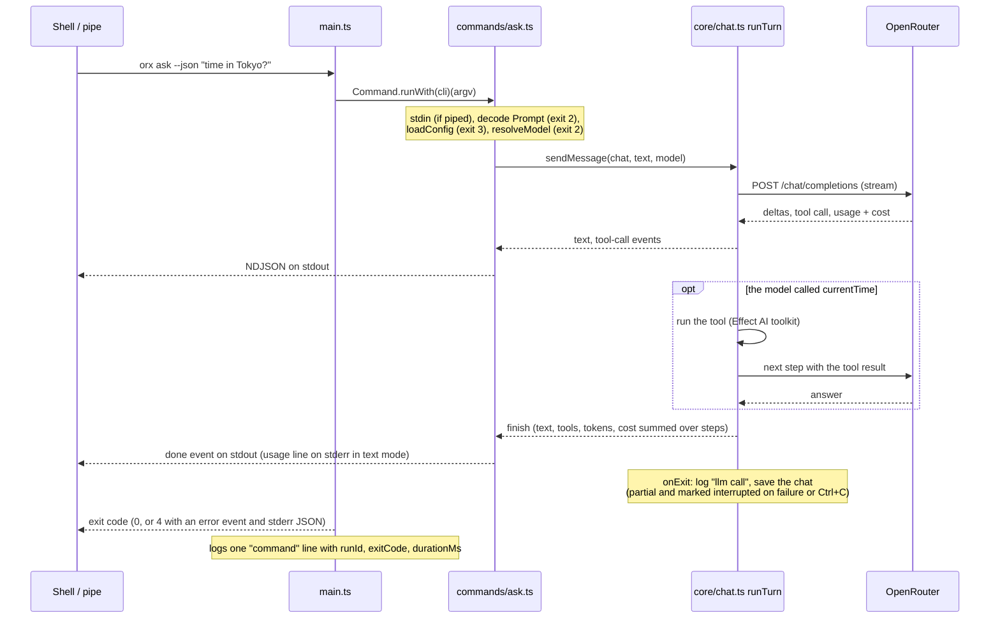

# The harness

This repo is built with coding agents, so most of its guardrails are aimed at the mistakes agents make. Each mistake is caught by more than one layer, and the earliest layer is the cheapest: a rule that keeps the agent from writing the bad line beats a hook that denies it, which beats a lint error seconds later, which beats a red CI run.

What's in the tree:

| Piece | What it does | Where |
| --- | --- | --- |
| Hooks | Guards that deny (destructive commands, secrets, generated files, platform imports outside `bin.ts`/`tui/`, wrong commands); lint and type feedback after each edit; formatting at the end of a turn; repo state at session start | `.claude/hooks/`, wired in `.claude/settings.json`; per-hook detail in [`.claude/README.md`](../.claude/README.md) |
| Path-scoped rules | Guidance that loads only when the agent touches matching files | `.claude/rules/src/` |
| Slash commands | `/check`, `/test`, `/add-command`, `/add-service`, `/add-tool`, `/feature` | `.claude/commands/` |
| Agents | `architect` and `reviewer`, both read-only | `.claude/agents/` |
| Skills | `effect`, `opentui`, `tui-design-slop` | `.agents/skills/` (linked into `.claude/skills/`) |
| Boundary plugin | Biome GritQL rules: the platform boundary, no `console` or `process.env` in `src/`, no Zod, colors only in `theme.ts`, no `effect` in TUI components | `biome-plugins/boundaries.grit` |
| Dev tools for agents | `bun run stub` (a local OpenRouter and releases), `bun run orx` (source run with logs), `bun run tui:capture` (the TUI's screen as text) | `scripts/` |
| Hook tests | A deny and a near miss for every guard, and every advisory hook end to end | `tests/hooks/` |

`AGENTS.md` is the agent's map of the code. This page is for a person who wants to know why the harness looks the way it does.

## Which layer catches what

Layers are listed earliest first. "Rule" means a file in `.claude/rules/src/` that loads when the agent touches matching files.

| Mistake | Prevention | Blocked or flagged | Backstop |
| --- | --- | --- | --- |
| Running the wrong test runner (bare `bun test`, vitest on `tests/tui`) | `AGENTS.md`, `testing.md` rule | `guard-commands.ts` denies it with the right command | none needed: the command never runs |
| Destroying work (`git reset --hard`, force push, `rm -rf /`) | none | `block-destructive.ts` denies it; `permissions.deny` repeats the worst shapes | `tests/hooks/` |
| Importing `bun:*`, `@effect/platform-bun`, or `@opentui/*` outside `src/bin.ts` and `src/tui/` | `cli.md`, `tui.md` rules | `guard-boundaries.ts` denies the write; the Grit plugin flags it | vitest fails to load the module on Node, then CI |
| Writing to stdout outside `Output` (a stray line breaks pipes and `orx mcp`) | `cli.md` rule | the Grit plugin flags `console.*` in `src/` | `tests/cli-contract.test.ts` and e2e assert stdout is empty on errors; `tests/mcp.test.ts` checks every stdout line is JSON-RPC |
| A new error without an exit code | `cli.md` rule | `tsc`: `exitCodeFor` and `retryableFor` switch exhaustively | `tests/units.test.ts` pins every code |
| Hand-editing generated files (`dist/`, `coverage/`, `bun.lock`, recorded fixtures) | `AGENTS.md` conventions | `guard-generated.ts` denies it and names the regenerating command | regenerating overwrites a hand edit anyway |
| Writing a secret into a file | `.env` is gitignored and `Read(./.env)` is denied; the config file schema rejects `apiKey` | `detect-secrets.ts` denies credential-shaped writes | `tests/config.test.ts` proves a key in the config file never reaches a request |
| Installing Zod, `@effect/schema`, Ink, or the MCP SDK | `AGENTS.md` | `guard-commands.ts` denies the install | the Grit plugin flags the import |
| A type error, including one in a caller of the edited file | none | `typecheck-on-write.ts` hands back `tsc` errors after each write | pre-push `typecheck`, CI |
| The TUI and the programs disagree (event shapes, errors) | `tui.md` rule | `tests/tui/closed-loop.test.tsx` renders `App` over the real bridge against the stub | e2e drives the binary's TUI in a PTY |
| OpenTUI taking over signals or Ctrl+C | `tui.md` rule | `tests/tui/launch.test.ts` pins the renderer options | e2e checks Ctrl+C exits 0 and leaves the alternate screen |
| A binary that builds but can't load its native library | `distribution.md` rule | `doctor --tui` in e2e | release.yml runs it on each OS and CPU before publishing |
| Stub drift: OpenRouter's real stream format moves away from the hand-written stub | `openrouter.md` rule | `tests/cli-contract.test.ts` replays recorded OpenRouter bodies (`tool.1`, `tool.2`) through the real provider | `bun run record:openrouter` re-records them (manual, needs a key) |
| A model regression: a model stops calling the tool, or extracts the wrong fields | none | `bun run eval --models a,b` through orx's own programs | manual only: needs a key and costs money |
| A convention no tool checks (thin commands, log once, decode at the boundary) | rules, `AGENTS.md` | the `reviewer` agent before a commit | `/feature` runs two code reviews before the PR |

Guards deny; everything else advises. Lint and type errors arrive as context and never block a write, so the agent keeps moving and fixes them on its next edit.

## One `orx ask` turn

`main` owns the process: it parses argv, runs one handler, and turns the outcome into stderr output and an exit code. The handler streams `TurnEvent`s from `core/chat.ts` and renders them through `Output`.

The retry happens inside `step` only while nothing has been emitted: once a delta reached stdout, repeating the request would print it twice.

## A five-minute demo

Run these from the repo root in your own terminal.

1. A hook denies a command (30 seconds): `echo '{"tool_name":"Bash","tool_input":{"command":"bun test"}}' | bun .claude/hooks/guard-commands.ts` prints a deny with the right command. `bun run test:unit tests/hooks` runs every hook test.
2. The boundary plugin flags a platform import (30 seconds): add `import "bun:ffi";` to `src/core/models.ts`, run `bun run lint`, and remove it.
3. Drive the CLI with no key (1 minute): `eval "$(bun run --silent stub)"`, then `bun run orx -- ask "hi"`, `bun run orx -- ask --bogus --json; echo $?` (stdout empty, exit 2), and `jq -c 'select(.msg=="command")' logs/orx.jsonl`.
4. See the TUI as an agent does (30 seconds): `bun run tui:capture -- chat --keys "hi<enter>" --wait-for "in /"`.
5. The `/feature` workflow (1 minute to explain): in Claude Code, `/feature <what to build>` writes an RFC in `docs/rfcs/`, has it challenged, executes it in a worktree with one subagent per work group, runs the gate and two code reviews, and opens a PR.

## Working in a worktree

`/feature` executes in a git worktree under `.claude/worktrees/` (gitignored). A worktree has its own `logs/` and `.orx/`, and `bun run stub` there starts its own stub only if none is running from that checkout; set `ORX_STUB_PORT` to run two at once.

## Related

- [`.claude/README.md`](../.claude/README.md): every hook, rule, and setting in detail.
- [`AGENTS.md`](../AGENTS.md): the agent's map of the code, commands, and conventions.
- [`docs/rfcs/0001-bootstrap-from-rra.md`](rfcs/0001-bootstrap-from-rra.md): why this repo is shaped the way it is.
